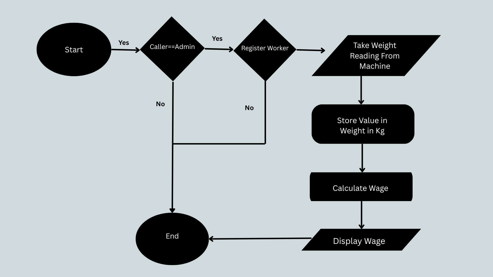
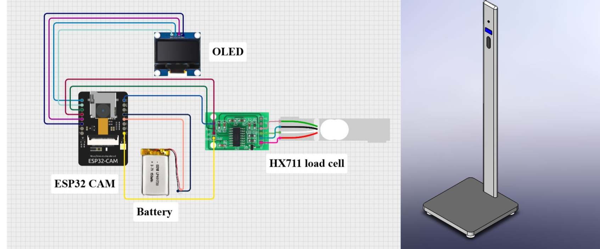
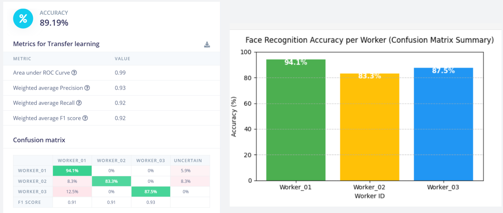
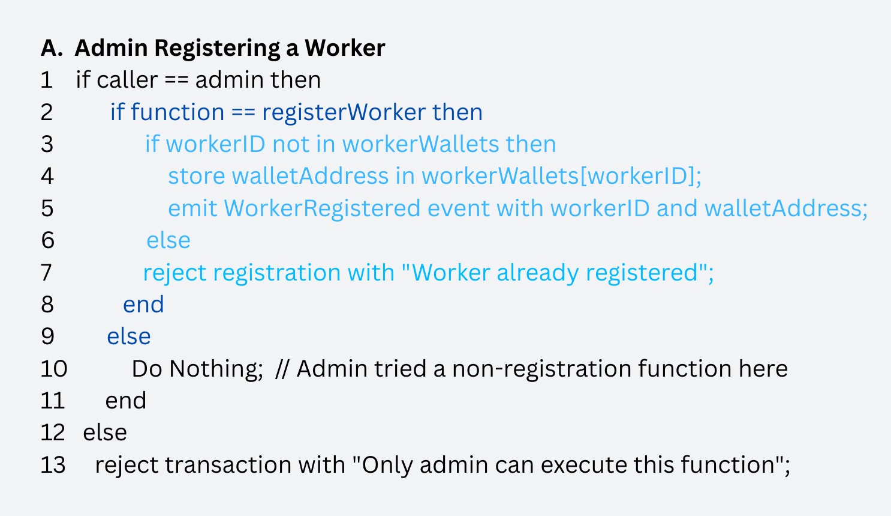
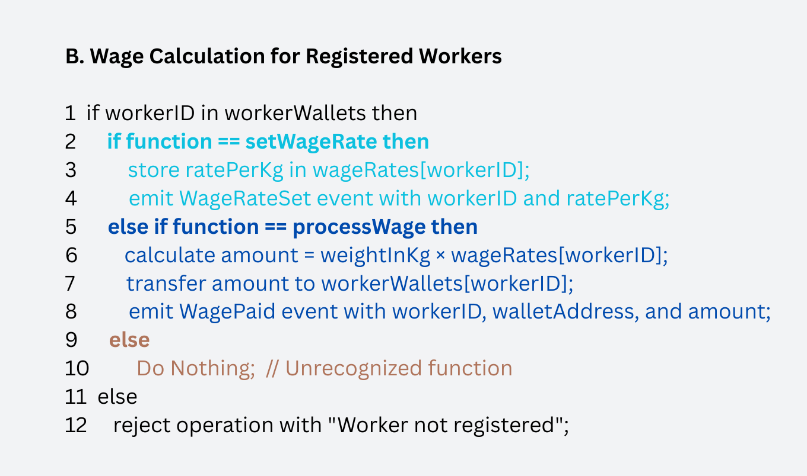
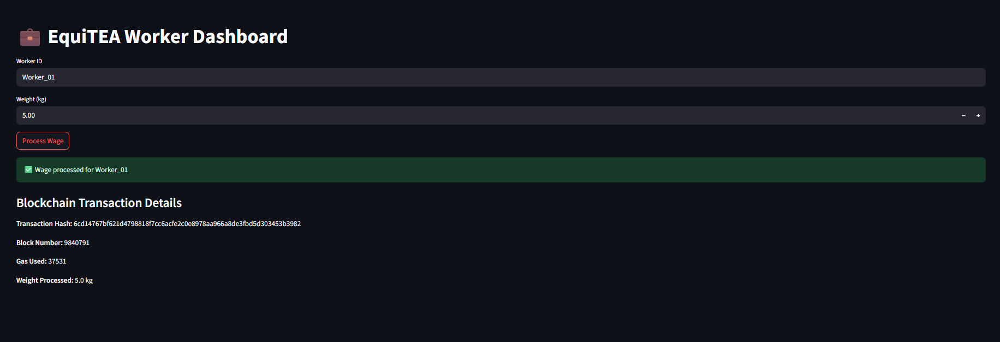
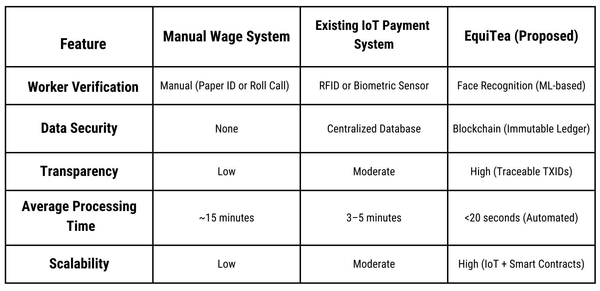

# EquiTEA  
**An IoT–Machine Learning–Blockchain Integrated System for Transparent Wage Payments in the Tea Industry of Bangladesh**

---

## Overview

EquiTEA is a research-driven, end-to-end wage automation system designed to address long-standing labor exploitation, delayed payments, and lack of transparency in Bangladesh’s tea industry. The project integrates **IoT-based weight measurement**, **machine learning–based facial recognition**, and **blockchain smart contracts** to ensure fair, timely, and verifiable wage payments directly to tea workers.

The system is designed with the infrastructural, socio-economic, and literacy constraints of Bangladeshi tea estates in mind, aiming to reduce fraud, eliminate intermediaries, and promote financial inclusion.

This repository represents the **overall EquiTEA project**, including system design, backend services, IoT components, and prototype implementations.

---

## Repository Structure

EquiTEA/
├── EquiTea_Backend/ # Backend implementation: computer-based prototype for worker identification, wage calculation, and blockchain integration
│ ├── app.py # Flask server for face recognition and wage processing
│ ├── blockchain.py # Blockchain interaction logic
│ ├── test_request.py # Script to test blockchain functions independently
│ ├── Simulated_UI.py # Prototype user interface for testing wage processing
│ ├── README.md # Documentation for EquiTea_Backend
│ └── known_faces/ # Directory storing facial images of workers (used for embeddings)
│ └── README.md # Notes on known_faces structure
├── EquiTea_IoT/ # IoT-based implementation: ESP32-CAM, sensors, and edge inference
│ └── sketch_oct22a/
│ ├── sketch_oct22a.ino # Arduino/ESP32-CAM sketch for hardware operation
│ ├── main_code.ino # Main Arduino code for IoT processing
│ ├── app_esp32.py # Python code for edge device inference
│ ├── blockchain.py # Blockchain logic adapted for IoT
│ ├── README.md # Documentation for sketch_oct22a
│ └── EquiTea_Image_Classification_inferencing/
│ └── README.md # Notes on image classification and edge inference
├── contracts/
│ └── EquiTEA.sol # Smart contract for wage computation and payment
├── EquiTEA_Figures/ # Folder containing all project diagrams and images for README
├── README.md # Root README for overall project description and usage
└── .gitignore # Git ignore rules for sensitive or temporary files

## Motivation
Bangladesh’s tea sector employs over 300,000 laborers, many of whom face:
- Delayed wages (sometimes up to 20 weeks)
- Manual, paper-based record keeping
- Wage miscalculation and exploitation
- Limited banking access and high illiteracy rates

EquiTEA proposes a **transparent, automated, and auditable wage payment mechanism** that replaces manual processes with a secure digital workflow.

---

## System Architecture (High Level)
EquiTEA consists of three tightly coupled layers:

### 1. IoT Layer
- Load cell + HX711 amplifier for accurate tea leaf weight measurement
- Camera-based worker identification at collection points
- Real-time data capture (weight, worker ID, timestamp)

### 2. Machine Learning Layer
- Facial recognition models trained using deep learning model
- Edge-optimized inference using MobileNetV2 / FaceNet-style embeddings
- On-device worker authentication
- Output: unique worker identifier (UID)

### 3. Blockchain Layer
- Ethereum-compatible smart contracts (designed for Polygon / BSC in production)
- Automated wage calculation based on verified weight data
- Direct payment to worker wallets
- Immutable transaction logs (TXIDs) for auditability

The proposed automated wage payment system integrates
hardware and software to enable accurate weight measurement of harvested tea leaves, secure worker authentication,
transparent wage calculation, and safe payment via blockchain
technology.

## Core Features

- **Biometric Worker Verification**  
  Facial recognition ensures non-transferable and fraud-resistant identification.

- **Accurate IoT-Based Weighing**  
  Load cell measurements provide precise tracking of harvested tea weight.

- **Automated Wage Calculation**  
  Smart contracts compute wages using predefined rates per kilogram.

- **Direct Digital Payments**  
  Wages are transferred directly to worker wallets without intermediaries.

- **Transparency and Auditability**  
  Every transaction is recorded on-chain with timestamps and TXIDs.

- **Accessibility Enhancements**
  - LCD/OLED display at weighing stations
  - Bangla voice output for wage announcements
  - QR / NFC-based backup identification

### Intended Deployment vs Prototype

## Intended Real-World System
- Raspberry Pi 4 for facial recognition and system orchestration
- Ethereum-compatible public blockchain (Polygon / BSC) for low-cost transactions
- Secure backend APIs for Web3 communication
- Mobile application for worker wage tracking and transparency

## Prototype Implementation
To evaluate the feasibility of the proposed EquiTEA system and verify the functional integrity of its core components, a working prototype was developed and tested. The prototype consists of four main elements:
(1) a hardware setup integrating sensing, processing, display, and power modules,
(2) a facial recognition subsystem for automatic worker identification,
(3) a blockchain-based smart contract framework for wage computation and payment, and
(4) a user interface (UI) for transparent visualization of wage transactions.

## A.Hardware Configuration

The prototype system consists of an ESP32-CAM module, an OLED display, an HX711 load cell amplifier, and a rechargeable lithium-polymer (Li-Po) battery. The ESP32-CAM is responsible for executing the facial recognition module, where inference is performed directly on-device using a pre-trained model. The HX711 load cell interface measures the weight of harvested tea leaves with high resolution and transmits the data to the ESP32-CAM. The processed weight information is then displayed on the OLED screen, providing immediate feedback to the operator at the collection point. The Li-Po battery serves as the primary power source for the system.

This hardware configuration is intended solely for proof-of-concept validation. In the final deployment, the ESP32-CAM will be replaced with a Raspberry Pi 4 to enhance computational performance, ensure stable network connectivity, and enable direct integration with the blockchain layer.

## B. Facial Recognition Module
The facial recognition subsystem was developed using Edge Impulse for model training and deployment on edge devices. Each worker was assigned a unique identifier (e.g., Worker 01, Worker 02, Worker 03) and photographed approximately 100 times under varying lighting conditions and viewing angles to ensure dataset diversity. The collected dataset was split into training and validation sets using an 80:20 ratio.
A MobileNetV2-based convolutional neural network was trained on 96 × 96 pixel input images for 20 epochs with a learning rate of 0.0005. The trained model achieved an overall accuracy of 89.19%, an AUC of 0.99, precision of 0.93, recall of 0.92, and an F1-score of 0.92, indicating strong classification performance. As shown in Fig. 3, the identification accuracies for Worker 01, Worker 02, and Worker 03 were 94.1%, 83.3%, and 87.5%, respectively.
The trained model was deployed on an ESP32-CAM module and evaluated through live testing, where it consistently returned correct worker identifications.

## C.Implementation of Blockchain Processes
The blockchain module enables secure and transparent wage computation and payment. The system was implemented on the Ethereum Sepolia testnet, which provides a safe and cost-free environment while retaining the full functionality of the Ethereum mainnet. Smart contract logic was developed using Solidity v0.8.x and incorporates role-based access control to restrict administrative operations. The contracts were implemented and tested using the Remix IDE, with account management and transaction signing handled through MetaMask. Contract deployment, verification, and auditing were performed using Etherscan to ensure correctness and transparency.

As illustrated in the figure, administrative verification must be performed before invoking the registerWorker function. Once verified, the admin can register a worker by storing the associated wallet address in the workerWallets mapping and emitting a WorkerRegistered event. Duplicate registrations are explicitly rejected, and any attempt by a non-admin account to call this function is denied, thereby enforcing secure, admin-only registration.

After registration, authorized workers can interact with the wage-related functions. The setWageRate function updates the wage configuration and emits a WageRateSet event, while the processWage function calculates the payable amount, transfers funds to the worker’s registered wallet, and emits a WagePaid event. Unregistered workers are blocked from accessing these functions, and unrecognized function calls are ignored, ensuring accurate and secure wage processing.

The smart contract was deployed to the Ethereum Sepolia testnet using the Remix IDE with an Injected Provider via MetaMask. All transactions related to worker registration, wage rate configuration, and wage payment were executed through MetaMask and subsequently verified on Etherscan using transaction hashes, block numbers, gas usage, and emitted events.

As shown in the figure, the transaction metrics of the EquiTEA system on the Ethereum Sepolia testnet indicate an average gas consumption of 40,745 units, a gas price of 20 Gwei, and a transaction cost of approximately 315 BDT, with an average confirmation time of 11 seconds. The relatively higher cost is a result of Sepolia’s simulated gas pricing. Deploying the system on more cost-efficient blockchain networks, such as Polygon Mainnet or Binance Smart Chain (BSC), is expected to reduce the transaction cost to below 1 BDT, thereby improving scalability and making the solution practical for real-world wage distribution.

## D.User Interface Prototype
A local UI prototype was developed to facilitate manual wage input, trigger blockchain transactions, and visualize transaction details such as transaction hash, block number, and processed weight.

## Evaluation Summary (Prototype)
- Facial recognition accuracy: **~89%**
- On-device inference validated on ESP32-CAM
- Successful smart contract deployment on Sepolia testnet
- Average confirmation time: **~11 seconds**
- Gas cost optimized for future deployment on low-fee networks

This separation ensures academic rigor by clearly distinguishing **system design intent** from **experimental validation**.

## Result Analysis
The current manual wage system is slow, relies on paper records, and requires manual calculations with intermediaries, often resulting in underpayment, fraud, and delays. Most tea workers face systemic challenges, including wage exploitation, lack of transparency regarding hours worked and payments, and an absence of verifiable records. While some estates have adopted IoT-based systems, these still depend on manual verification and centralized databases.

EquiTEA addresses these issues by integrating IoT-enabled weighing modules and facial recognition to record output in real-time, while blockchain smart contracts handle payments with open, immutable records accessible to both workers and management. This approach ensures accurate and transparent wage computation, eliminates underpayment, reduces reliance on intermediaries, enables near-instant payment, and rebuilds trust—ultimately providing greater long-term economic security for workers. The figure below presents a comparative analysis of the traditional manual wage system, existing IoT payment solutions, and the proposed IoT–ML–Blockchain-based EquiTEA system.

## Security and Privacy
EquiTEA follows a layered security model:
- Facial data stored as **non-reversible embeddings**, never raw images
- Blockchain stores **UIDs only**, no personal information
- Role-based access control for admin operations
- End-to-end AES-256 encryption for IoT data transmission
- Complete audit trail via immutable blockchain records

## Limitations and Future Work
- Connectivity challenges in remote tea estates
- Need for low-cost, high-throughput blockchain networks
- Worker training and technology adoption
- Regular calibration and maintenance of IoT devices

## Future work includes:
- Migration to Raspberry Pi–based production hardware
- Deployment on Polygon or BSC mainnet
- Integration with mobile banking systems
- Collaboration with NGOs and government bodies
- Adaptation for other labor-intensive sectors (garments, fisheries, agriculture)

---

## Academic Context

- Accepted at the **28th International Conference on Computer and Information Technology (ICCIT 2025)** and the **6th IEEE International Conference on Telecommunications and Photonics (ICTP 2025)**.

- Presented at the **28th International Conference on Computer and Information Technology (ICCIT 2025)**.

- Intended for publication in **IEEE Xplore**, with indexing in **Scopus**.

- Ranked among the **Top 9 teams nationwide** at the *IPE Sphere Project Fair*, a national competition organized by the **SUST IPE Department** as part of its 30-year academic celebration.

- **Finalist** at *MIST Inventious 4.1* (Project Showcase Segment) organized by the **Military Institute of Science and Technology (MIST) Innovation Club**.

- Presented at the **3rd International Conference on Science, Technology, Engineering, Mathematics, and Education (iSTEME 2025)**, organized by **Huston–Tillotson University**.

---

## License

This project is released for academic and research purposes.  
Commercial deployment requires appropriate ethical, legal, and regulatory approvals.

---
